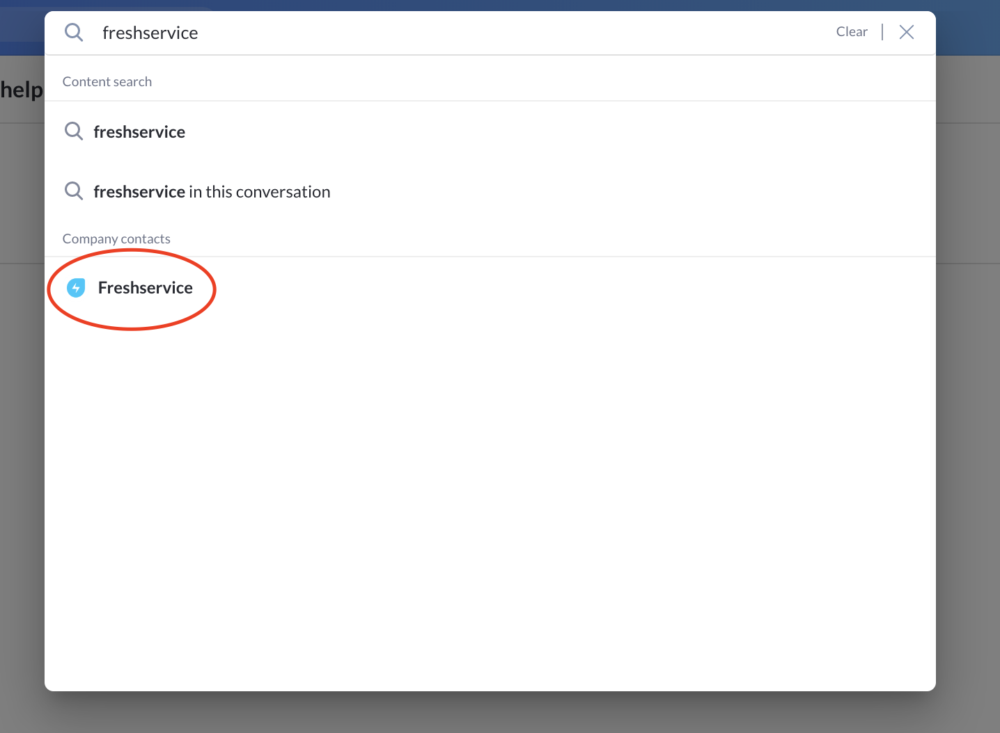
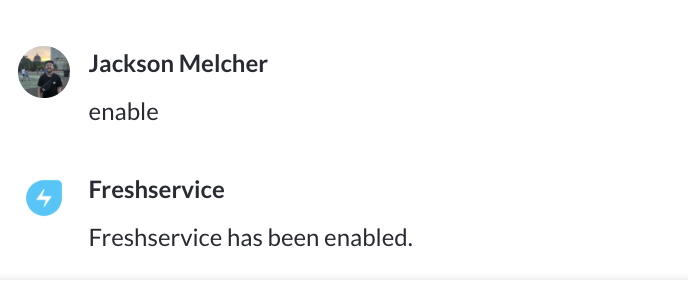
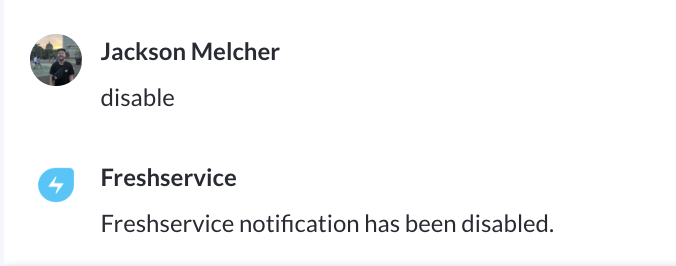
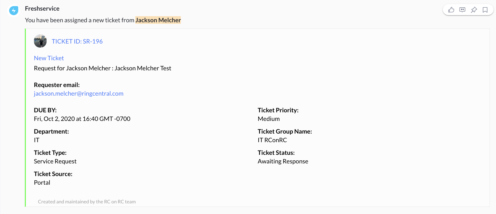
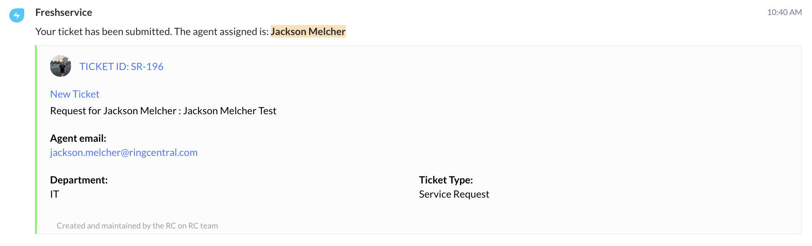

# Glip Freshservice Bot

Freshservice bot sends you relevant freshservice notifications through Glip. It currently supports submission notifications, ticket assignment notifications, and reassignment notifications.

## Table of Contents

-   [Availibility](#Availibility)
-   [Feedback](#We-want-your-feedback)
-   [Installation](#Installation)
-   [Enable notifications](#Enable_notifications)
-   [Disable notifications](#Disable_notifications)
-   [Examples](#Examples)

## Availibility

Freshservice bot is in its first stages of development and is only available only to RC employees at this time.

## We want your feedback

We'd love to hear your feedback about Freshservice Bot. If you spot bugs or have features that you'd really like to see, please check out the [bug and feature sumbission form](https://forms.gle/KKYKVVoxUN5z32dY7).

## Getting started

### Installation

Freshservice bot has already been installed on Glip and all you need to do is run a global search for "Freshservice" and click the bot that looks like this:

### Enable notifications

To enable notifications simply send `enable` to the bot. You should get a response like this:

### Disable notifications

To disable notifications simply send `disable` to the bot. You should get a response like this:

## Usage

Freshservice will automatically send you notifications when you submit a ticket, are assigned a ticket, or a ticket is reassigned to you. Please join **RC on RC integration help** for help setting up webhooks with Freshservice workflows.

## Examples

#### Agent message

#### Requester message

